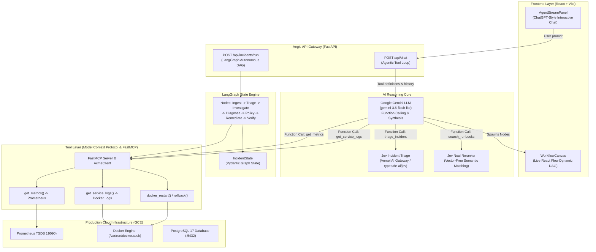

# Aegis AI Architecture: LangGraph, LLMs, MCP & Jev AI Technical Deep-Dive

This document provides a comprehensive technical breakdown of how **Aegis** is coded, how its agentic workflow is constructed with **LangGraph**, how **Google Gemini** executes function calling, how **Jev AI** is utilized for triage and reranking, and how **Model Context Protocol (MCP)** tools connect to live cloud infrastructure.

Use this document to prepare for technical presentations, code walkthroughs, and architecture reviews.

---

## 1. System Architecture & Component Interactions



---

## 2. LangGraph State Machine Architecture

### A. Why LangGraph?
Instead of a brittle, hardcoded linear script or an unconstrained autonomous loop that could hallucinate endless tool calls, Aegis uses **LangGraph** (`aegis/graph/workflow.py`) to enforce a **deterministic, auditable, stateful Directed Acyclic Graph (DAG)** with strict human-in-the-loop policy checkpoints.

### B. Core State Schema: `IncidentState`
The entire lifecycle of an incident is modeled as a strongly typed Pydantic object defined in [aegis/core/state.py](file:///s:/1.capg_onsite2/aegis/core/state.py):

```python
class IncidentState(BaseModel):
    incident_id: str
    status: Literal["TRIGGERED", "INVESTIGATING", "DIAGNOSED", "PENDING_APPROVAL", "MITIGATING", "RESOLVED", "ESCALATED"]
    service_name: str
    alert: IncidentAlert                    # Raw incoming alert payload
    triage: Optional[TriageResult]          # Severity (P1-P4), domain, confidence
    evidence: EvidenceBundle                # Metrics from Prometheus, logs from Docker
    diagnosis: Optional[DiagnosisResult]    # Root cause analysis & recommended action
    retrieved_runbooks: List[RetrievedRunbook] # Ranked runbooks from Jev Reranker
    policy_evaluation: Optional[PolicyEvaluation] # Safety engine approval requirements
    remediation: Optional[RemediationResult] # Execution exit codes and outputs
    verification: Optional[VerificationResult] # Post-remediation SLO checks
    human_approval: Optional[HumanApproval]   # Approver identity and timestamp
    current_step: str
```

### C. The Node Pipeline & Workflow Graph
In [aegis/graph/workflow.py](file:///s:/1.capg_onsite2/aegis/graph/workflow.py), a `StateGraph(IncidentState)` is compiled with the following deterministic stages:

1. **`ingest_node`**: Normalizes the incoming alert from PagerDuty/Prometheus alertmanager into an open incident.
2. **`triage_node`**: Invokes `JevTriage` to classify severity (`P1` to `P4`) and failing domain (`database`, `deployment`, `network`, `application`).
3. **`investigate_node`**: Calls `AcmeClient` / MCP tools to pull telemetry:
   - Prometheus metrics: Error rate, P95 latency, active DB connections.
   - Container logs: Last 50 lines filtered for `ERROR`, `FATAL`, or `Exception`.
4. **`retrieve_knowledge_node`**: Fetches markdown runbooks and runs `JevReranker` to find the exact matching remediation procedure.
5. **`diagnose_node`**: Invokes the **Diagnosis Agent** (`aegis/agents/diagnosis.py`) where Gemini analyzes the evidence, runbooks, and logs to synthesize a root-cause hypothesis.
6. **`policy_gate_node`**: Evaluates the action against the deterministic **Policy Engine** (`aegis/policy/engine.py`). If the action is `HIGH` risk (such as a production rollback), it pauses the graph and transitions `status = PENDING_APPROVAL`.
7. **`remediate_node`**: Triggered only after approval; executes `NeedleExecutor` (container rollback or restart).
8. **`verify_node`**: Queries Prometheus to ensure error rate dropped below 1.0% and P95 latency returned to baseline.

### D. Dual Execution Architecture
Aegis supports two execution modes:
1. **Autonomous DAG Pipeline**: Run programmatically via `POST /api/incidents/run`.
2. **Interactive Agentic Chat**: Driven via `POST /api/chat` in [aegis/api/main.py](file:///s:/1.capg_onsite2/aegis/api/main.py). In this mode, the LLM autonomously decides which tools to call in response to operator conversation, dynamically generating and rendering nodes on the React Flow canvas in real time.

---

## 3. Jev AI Integration: Triage & Noul Reranker

Aegis leverages **Jev AI** via the **Vercel AI Gateway** (`https://ai-gateway.vercel.sh/v1/evaluate`) with the `typesafe-ai/jev` model.

### A. Jev Incident Triage (`aegis/triage/jev_triage.py`)

#### What We Feed into Jev Triage:
We send a structured HTTP POST request containing the alert context and explicit evaluation criteria:
```json
{
  "model": "typesafe-ai/jev",
  "state": {
    "title": "Elevated 500 Error Rate in checkout-service",
    "description": "500 DatabaseTimeout acquiring connection from pool (limit=5)",
    "service": "checkout-service"
  },
  "questions": {
    "severity": {
      "type": "choice",
      "instructions": "Determine incident severity level.",
      "criteria": {
        "P1": "Critical outage, service completely unavailable, or elevated 5xx errors",
        "P2": "Degraded performance, high latency, or intermittent errors",
        "P3": "Minor issue or non-critical background error",
        "P4": "Informational or cosmetic notice"
      }
    },
    "domain": {
      "type": "choice",
      "instructions": "Identify the primary failing domain.",
      "criteria": {
        "deployment": "Recent software release, rollback, or version change",
        "database": "Connection pool exhaustion, slow queries, or DB timeouts",
        "network": "DNS failure, packet loss, or gateway timeouts",
        "application": "Unhandled code exception, memory leak, or crash"
      }
    }
  }
}
```

#### What We Get Out of Jev Triage:
Jev returns deterministic choice evaluations accompanied by calibrated confidence probabilities:
```json
{
  "answers": {
    "severity": {
      "choice": "P1",
      "confidence": 0.98
    },
    "domain": {
      "choice": "database",
      "confidence": 0.96
    }
  }
}
```
**Why this matters**: Instead of relying on non-deterministic free-form text parsing, Jev gives mathematically scored categorical classifications, preventing hallucinations during triage.

#### Tiered Fallback Architecture:
If the external network or gateway is unavailable, `JevTriage` gracefully degrades:
- **Tier 1**: Vercel AI Gateway (`typesafe-ai/jev`).
- **Tier 2**: Google Gemini structured JSON output (`response_mime_type="application/json"`).
- **Tier 3**: Deterministic regex heuristic safety net.

---

### B. Jev Noul Reranker (`aegis/rag/jev_reranker.py`)

#### Why a Vectorless Reranker?
Traditional RAG systems use vector databases (Chroma, Pinecone) with cosine similarity over embeddings. In fast-moving SRE production environments, vector embeddings suffer from:
1. **Embedding Drift**: Subtle differences between error messages (`Connection pool exhausted` vs `Database unreachable`) can lead to wrong vector neighbor hits.
2. **Indexing Lag**: Updating runbooks requires re-embedding all documents.
3. **High Latency**: Embedding calls add hundreds of milliseconds.

The **Jev Noul Reranker** evaluates semantic relevance directly between incident symptoms and candidate runbook texts without vector indices.

#### What We Feed into Jev Reranker:
Candidate runbooks from [aegis/rag/retriever.py](file:///s:/1.capg_onsite2/aegis/rag/retriever.py) (e.g. `RB-001: Connection Pool Exhaustion`, `RB-002: Upstream Gateway Timeout`, `RB-003: Memory Leak Mitigation`) are mapped into boolean evaluation queries:
```json
{
  "model": "typesafe-ai/jev",
  "state": {
    "symptoms": "Database connection pool timeout, checkout error rate 38.5%, active connections 5/5"
  },
  "questions": {
    "relevance_RB-001": {
      "type": "boolean",
      "instructions": "Does the document titled 'Connection Pool Exhaustion Runbook' describe the resolution for these symptoms?"
    },
    "relevance_RB-002": {
      "type": "boolean",
      "instructions": "Does the document titled 'Payment Gateway Timeout' describe the resolution for these symptoms?"
    }
  }
}
```

#### What We Get Out of Jev Reranker:
```json
{
  "answers": {
    "relevance_RB-001": {
      "choice": true,
      "confidence": 0.93
    },
    "relevance_RB-002": {
      "choice": false,
      "confidence": 0.88
    }
  }
}
```
`JevReranker` calculates a score for each document:
$$\text{Score} = \text{confidence if true} \quad \text{else} \quad (1.0 - \text{confidence})$$
`RB-001` receives a score of `0.93` and is placed at index 0 of `retrieved_runbooks`.

---

## 4. Model Context Protocol (MCP) & FastMCP Configuration

### A. What is MCP?
The **Model Context Protocol (MCP)** provides a standard interface for AI models to discover, inspect, and execute tools on external systems. Aegis implements both an **MCP Server** (`aegis/mcp/server.py`) and an **MCP Client** (`aegis/mcp/client.py`).

### B. FastMCP Server Implementation (`aegis/mcp/server.py`)
Using the `FastMCP` framework, tools are decorated with `@mcp.tool()`:

```python
from mcp.server.fastmcp import FastMCP
from aegis.acme.client import AcmeClient

mcp = FastMCP("Aegis-AcmeCloud-Gateway")
client = AcmeClient()

@mcp.tool()
async def get_metrics(service: str, window: str = "15m") -> dict:
    """Fetch Prometheus telemetry for an AcmeCloud microservice."""
    return await client.get_metrics(service, window)

@mcp.tool()
async def get_service_logs(service: str, query: str = "error", window: str = "15m") -> list:
    """Fetch live Docker error logs for a service."""
    return await client.get_logs(service, query, window)

@mcp.tool()
async def rollback_deployment(service: str, target_version: str) -> dict:
    """Execute a zero-downtime rollback in Docker Compose."""
    return await client.rollback_deployment(service, target_version)
```

### C. The AcmeClient Enterprise Bridge (`aegis/acme/client.py`)
`AcmeClient` translates high-level MCP requests into live system operations:
- **Prometheus Telemetry**: Connects over HTTP to `http://localhost:9090/api/v1/query` and queries:
  - Error rate: `sum(checkout_errors_total) / sum(checkout_requests_total)`
  - Active DB connections: `db_connections_active`
  - Latency: `histogram_quantile(0.95, sum(rate(checkout_latency_bucket[5m])) by (le))`
- **Live Docker Engine Integration**: Interacts directly with Docker over `/var/run/docker.sock` to tail logs, restart containers, and switch deployment environment files.

---

## 5. The Specialized Agents Architecture

Aegis decomposes SRE operations into five specialized agents:

| Agent | Module | Role & Responsibility |
| :--- | :--- | :--- |
| **Triage Agent** | [aegis/triage/jev_triage.py](file:///s:/1.capg_onsite2/aegis/triage/jev_triage.py) | Ingests alerts, classifies severity (`P1` to `P4`), identifies failing subsystem domain. |
| **Investigation Agent** | [aegis/agents/investigation.py](file:///s:/1.capg_onsite2/aegis/agents/investigation.py) | Gathers telemetry evidence, scrapes error logs, queries CMDB topology, and checks SLO baselines. |
| **Diagnosis Agent** | [aegis/agents/diagnosis.py](file:///s:/1.capg_onsite2/aegis/agents/diagnosis.py) | Performs Root Cause Analysis (RCA) using Gemini reasoning and cross-references Jev-ranked runbooks. |
| **Policy Engine** | [aegis/policy/engine.py](file:///s:/1.capg_onsite2/aegis/policy/engine.py) | Enforces deterministic safety rules (`PROD_ROLLBACK_APPROVAL`, blast radius limits, active change freeze windows). |
| **Remediation Executor** | [aegis/executor/needle_executor.py](file:///s:/1.capg_onsite2/aegis/executor/needle_executor.py) | Executes verified remediation actions against real Linux containers with sub-second rollback capabilities. |

---

## 6. LLM Tool Calling & Dynamic Canvas Generation

### A. Declarative Function Calling in `POST /api/chat`
In [aegis/api/main.py](file:///s:/1.capg_onsite2/aegis/api/main.py), Gemini is equipped with declarative tool schemas:
- `triage_incident(incident_id, service)`
- `get_metrics(service)`
- `get_service_logs(service)`
- `search_runbooks(query, service)`
- `evaluate_policy(action, target_service)`
- `rollback_deployment(service, target_version)`
- `docker_restart_container(container_name)`
- `verify_slo(service)`

### B. The Multi-Turn Agentic Execution Loop
When a user says *"Investigate checkout service outage"*:
1. Gemini inspects the available tools and determines it needs to call `triage_incident` and `get_metrics`.
2. The FastAPI backend intercepts the `FunctionCall` candidate, executes the corresponding Python function against AcmeCloud/Jev, and maps the output into a `FunctionResponse` part.
3. The response is appended to the message history, and Gemini is invoked again to synthesize the findings.
4. **Dynamic Canvas Synchronization**: For every tool executed, the backend emits the corresponding node ID (`'ingest'`, `'triage'`, `'tool-metrics'`, `'tool-logs'`) to `new_nodes`. The frontend `App.tsx` immediately renders the node on the React Flow canvas with smooth animations.

---

## 7. Presentation & Defense Q&A: Technical Cheat-Sheet

Be prepared to answer these questions during evaluations:

### Q1: "Why use Gemini 3.5 Flash-Lite or 3.6 Flash instead of Claude 3.5 Sonnet or GPT-4o?"
> **Answer**: "In incident response, Mean Time to Recovery (MTTR) is paramount. Gemini Flash-Lite models deliver sub-second time-to-first-token latency and native function calling at a fraction of the token cost. Combined with LangGraph deterministic guardrails and Jev AI categorical evaluations, we achieve enterprise-grade reliability without the multi-second latency of heavier models."

### Q2: "Why not use a standard vector database like ChromaDB or Pinecone for your RAG pipeline?"
> **Answer**: "Standard vector databases rely on cosine similarity across dense embeddings. SRE runbooks often share identical vocabularies ('database', 'timeout', 'retry') despite addressing completely different root causes. The Jev Noul Reranker performs zero-shot boolean semantic evaluations across candidate documents, eliminating vector drift and indexing overhead while guaranteeing that runbooks matching the exact error signature are selected."

### Q3: "How do you prevent the AI from executing a destructive command or hallucinating an unapproved rollback?"
> **Answer**: "We enforce a strict separation of concerns: The LLM suggests hypotheses, but the **Deterministic Policy Engine** (`aegis/policy/engine.py`) enforces hard-coded organizational rules. The Policy Engine operates independently of the LLM. If an action like `rollback_deployment` in production is proposed, the Policy Engine overrides autonomous execution and triggers a `PENDING_APPROVAL` human-in-the-loop gate."

### Q4: "Is this actually running on real cloud infrastructure or is it a mock simulation?"
> **Answer**: "Everything is running live on a Google Compute Engine VM (`e2-standard-4`). Transactions are processed by a real Python FastAPI microservice, orders are written to a real PostgreSQL 17 database, metrics are scraped in real time by Prometheus, and rollbacks are executed by live Docker daemon commands over `/var/run/docker.sock`."

### Q5: "How does the frontend stay synchronized with the backend AI execution?"
> **Answer**: "We built a dual-channel reactive frontend. Chat messages and tool outputs stream over HTTP SSE/JSON with structured schemas. When tools execute, the API returns a `new_nodes` list. The React frontend appends these IDs to `visibleNodeIds`, which triggers progressive node and edge layout calculations on the React Flow canvas."
