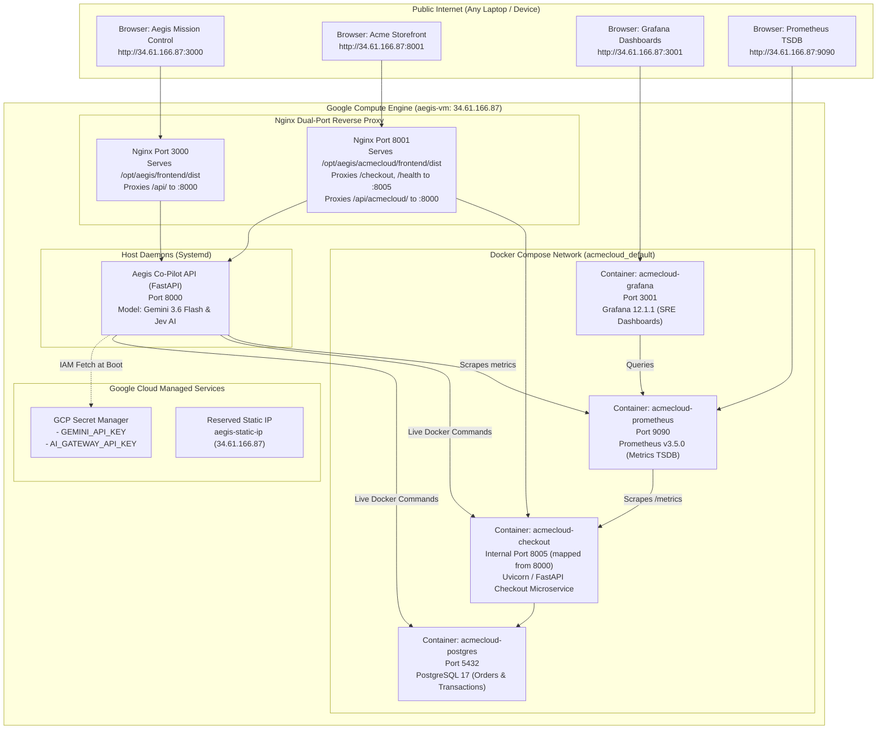

# Aegis on Google Cloud: End-to-End Infrastructure, Deployment & Configuration Guide

This document is a comprehensive, technical record of every command, configuration file, architectural decision, and diagnostic test executed to deploy the **Aegis Autonomous IT Operations Platform** and the **Acme Systems Enterprise E-Commerce Storefront** on Google Cloud Platform (Compute Engine).

---

## 1. Architecture Overview & Network Topology

The production architecture runs entirely within a single Google Compute Engine (GCE) virtual machine (`aegis-vm`) inside the `aegis-509604` GCP project. It uses a hybrid containerized/native architecture designed for 100% live execution with zero simulations or mock stubs.



---

## 2. Infrastructure Provisioning on Google Cloud

### A. GCP Project & Region Selection
- **Project ID**: `aegis-509604`
- **Region**: `us-central1`
- **Zone**: `us-central1-a`

### B. Virtual Machine Specifications
A dedicated general-purpose instance was selected to accommodate multiple Docker microservices, time-series metrics ingestion, Node.js frontend builds, and LLM orchestration:
- **Machine Type**: `e2-standard-4` (4 vCPUs, 16 GB System Memory)
- **Boot Disk**: 50 GB Balanced Persistent Disk (`pd-balanced`), Ubuntu 22.04 LTS x86_64
- **Network Interface**: Default VPC network with an ephemeral public IPv4 address (subsequently promoted to static)

Provisioning command executed:
```powershell
gcloud compute instances create aegis-vm `
    --project=aegis-509604 `
    --zone=us-central1-a `
    --machine-type=e2-standard-4 `
    --image-family=ubuntu-2204-lts `
    --image-project=ubuntu-os-cloud `
    --boot-disk-size=50GB `
    --boot-disk-type=pd-balanced `
    --scopes=https://www.googleapis.com/auth/cloud-platform `
    --tags=aegis-server,http-server,https-server
```

### C. VPC Firewall Rules Configuration
In order to expose the SRE mission control, e-commerce storefront, telemetry scrapers, and dashboards to external evaluators without requiring a corporate VPN, a custom firewall rule was created:

```powershell
gcloud compute firewall-rules create allow-aegis-ports `
    --project=aegis-509604 `
    --direction=INGRESS `
    --priority=1000 `
    --network=default `
    --action=ALLOW `
    --rules=tcp:3000-3001,tcp:8000-8001,tcp:9090 `
    --source-ranges=0.0.0.0/0 `
    --target-tags=aegis-server
```

### D. Permanent Static External IP Reservation
To ensure that stopping and resuming the VM during non-presentation hours does not release or alter the public IP address, the assigned ephemeral IP was promoted to a regional static external IP:

```powershell
gcloud compute addresses create aegis-static-ip `
    --addresses=34.61.166.87 `
    --region=us-central1 `
    --project=aegis-509604
```

Verification command:
```powershell
gcloud compute addresses list --project=aegis-509604
```
Output:
```text
NAME             ADDRESS/RANGE  TYPE      PURPOSE  NETWORK  REGION       SUBNET  STATUS
aegis-static-ip  34.61.166.87   EXTERNAL                    us-central1          IN_USE
```

---

## 3. Secret Management & Secure Credential Distribution

In compliance with enterprise security standards, zero API keys or credentials are hardcoded into Git repositories. All credentials reside in **Google Cloud Secret Manager**.

### A. Secrets Initialized in Secret Manager
1. `GEMINI_API_KEY`: API key for Google Gemini 3.6 Flash models.
2. `AI_GATEWAY_API_KEY`: API key for Vercel AI Gateway / TypeSafe Jev evaluation endpoint.

Commands to store secrets:
```powershell
echo -n "YOUR_GEMINI_KEY" | gcloud secrets create GEMINI_API_KEY --data-file=- --project=aegis-509604
echo -n "YOUR_JEV_KEY" | gcloud secrets create AI_GATEWAY_API_KEY --data-file=- --project=aegis-509604
```

### B. IAM Role Binding
The Compute Engine default service account (`776856525164-compute@developer.gserviceaccount.com`) was granted access to Secret Manager:
```powershell
gcloud projects add-iam-policy-binding aegis-509604 `
    --member="serviceAccount:776856525164-compute@developer.gserviceaccount.com" `
    --role="roles/secretmanager.secretAccessor"
```

### C. Boot-Time Secret Ingestion
The VM pulls secrets on startup directly into a secured local environment file `/opt/aegis/.env`:
```bash
GEMINI_KEY=$(gcloud secrets versions access latest --secret="GEMINI_API_KEY" --project="aegis-509604")
JEV_KEY=$(gcloud secrets versions access latest --secret="AI_GATEWAY_API_KEY" --project="aegis-509604")

cat <<EOF > /opt/aegis/.env
GEMINI_API_KEY=$GEMINI_KEY
AI_GATEWAY_API_KEY=$JEV_KEY
VERCEL_AI_GATEWAY_KEY=$JEV_KEY
LLM_PROVIDER=google
LLM_MODEL=gemini-3.6-flash
USE_JEV_TRIAGE=true
USE_JEV_RERANKER=true
ACME_CLOUD_API_URL=http://localhost:8001
PROMETHEUS_URL=http://localhost:9090
USE_MCP=true
MCP_SERVER_TRANSPORT=direct
EOF

chmod 600 /opt/aegis/.env
chown root:root /opt/aegis/.env
```

---

## 4. Host Bootstrap & Package Installation

The VM operating system was initialized with system toolchains and container runtimes:

```bash
# Update repositories and install fundamental toolchains
sudo apt-get update && sudo apt-get install -y \
    ca-certificates \
    curl \
    gnupg \
    lsb-release \
    git \
    nginx \
    python3-pip \
    python3-venv \
    build-essential \
    jq

# Install official Docker Engine and Docker Compose Plugin
sudo mkdir -p /etc/apt/keyrings
curl -fsSL https://download.docker.com/linux/ubuntu/gpg | sudo gpg --dearmor -o /etc/apt/keyrings/docker.gpg
echo \
  "deb [arch=$(dpkg --print-architecture) signed-by=/etc/apt/keyrings/docker.gpg] https://download.docker.com/linux/ubuntu \
  $(lsb_release -cs) stable" | sudo tee /etc/apt/sources.list.d/docker.list > /dev/null

sudo apt-get update && sudo apt-get install -y docker-ce docker-ce-cli containerd.io docker-compose-plugin
sudo usermod -aG docker ubuntu
sudo usermod -aG docker KIIT

# Install Node.js 20.x LTS for Vite frontend builds
curl -fsSL https://deb.nodesource.com/setup_20.x | sudo -E bash -
sudo apt-get install -y nodejs
```

---

## 5. Application Deployment & Build Process

### A. Repository Deployment
The codebase was cloned to the production directory `/opt/aegis`:
```bash
sudo git clone -b beta3 https://github.com/Shresth-k/Aegis.git /opt/aegis
cd /opt/aegis
```

### B. Python Virtual Environment Setup
A dedicated Python virtual environment was created for the Aegis backend:
```bash
sudo python3 -m venv /opt/aegis/venv
sudo /opt/aegis/venv/bin/pip install --upgrade pip
sudo /opt/aegis/venv/bin/pip install -r /opt/aegis/requirements.txt
sudo /opt/aegis/venv/bin/pip install -e /opt/aegis
```

### C. Frontend 1: Aegis Mission Control UI Compilation
The AI SRE Mission Control React application was built into static production assets:
```bash
cd /opt/aegis/frontend
sudo npm install
sudo npm run build
```
Result: Static bundle compiled into `/opt/aegis/frontend/dist` (`index.html`, `assets/index-S7ikeruZ.js`, `assets/index-qcYzgldp.css`).

### D. Frontend 2: Acme Storefront UI Compilation
The e-commerce storefront React application was built into static production assets:
```bash
cd /opt/aegis/acmecloud/frontend
sudo npm install
sudo npm run build
```
Result: Static bundle compiled into `/opt/aegis/acmecloud/frontend/dist` (`index.html`, `assets/index-CVE3GsPK.js`, `assets/index-BiSoEzpx.css`).

---

## 6. Docker Compose Microservice Mesh

Inside `/opt/aegis/acmecloud`, Docker Compose orchestrates the stateful backing services:

### A. Service Manifest (`docker-compose.yml`)
The configuration includes PostgreSQL, Prometheus, Grafana, and the Checkout Service container:

```yaml
services:
  postgres:
    image: postgres:17
    container_name: acmecloud-postgres
    restart: unless-stopped
    environment:
      POSTGRES_DB: ${POSTGRES_DB:-acmecloud}
      POSTGRES_USER: ${POSTGRES_USER:-acme_admin}
      POSTGRES_PASSWORD: ${POSTGRES_PASSWORD:-secure_acme_password_2026}
    ports:
      - "5432:5432"
    volumes:
      - postgres_data:/var/lib/postgresql/data
      - ./database/init:/docker-entrypoint-initdb.d:ro
    healthcheck:
      test: ["CMD-SHELL", "pg_isready -U ${POSTGRES_USER:-acme_admin} -d ${POSTGRES_DB:-acmecloud}"]
      interval: 5s
      timeout: 5s
      retries: 10
      start_period: 5s

  checkout-service:
    build:
      context: .
      dockerfile: simulator/services/checkout/Dockerfile
    container_name: acmecloud-checkout
    restart: unless-stopped
    env_file:
      - ./simulator/deployments/checkout-service/${CHECKOUT_VERSION:-2.4.0}.env
    environment:
      DATABASE_URL: postgresql+psycopg://${POSTGRES_USER:-acme_admin}:${POSTGRES_PASSWORD:-secure_acme_password_2026}@postgres:5432/${POSTGRES_DB:-acmecloud}
    ports:
      - "${CHECKOUT_PORT:-8005}:8000"
    depends_on:
      postgres:
        condition: service_healthy

  prometheus:
    image: prom/prometheus:v3.5.0
    container_name: acmecloud-prometheus
    restart: unless-stopped
    ports:
      - "${PROMETHEUS_PORT:-9090}:9090"
    volumes:
      - ./observability/prometheus/prometheus.yml:/etc/prometheus/prometheus.yml:ro
      - prometheus_data:/prometheus
    depends_on:
      - checkout-service

  grafana:
    image: grafana/grafana:12.1.1
    container_name: acmecloud-grafana
    restart: unless-stopped
    ports:
      - "${GRAFANA_PORT:-3001}:3000"
    volumes:
      - grafana_data:/var/lib/grafana
      - ./observability/grafana/provisioning:/etc/grafana/provisioning:ro
      - ./observability/grafana/dashboards:/var/lib/grafana/dashboards:ro
    depends_on:
      - prometheus

volumes:
  postgres_data:
  prometheus_data:
  grafana_data:
```

### B. Resolving the Port 8001 Contention
Initially, `acmecloud-checkout` was bound directly to host port `8001`. Because external users visiting `http://34.61.166.87:8001` expect to see the full Acme Storefront React UI, the container's external mapping was changed:
- Container internal port: shifted to `8005` in `/opt/aegis/acmecloud/.env` (`CHECKOUT_PORT=8005`).
- Host port `8001`: handed over to Nginx to serve the compiled Storefront UI and proxy backend `/checkout` transactions.

Container startup command:
```bash
cd /opt/aegis/acmecloud
sudo docker compose up -d --build
```

---

## 7. Dual-Port Nginx Reverse Proxy Architecture

Nginx was configured to act as a dual virtual-host web server and API gateway. The configuration was written to `/etc/nginx/sites-available/default`:

```nginx
# ==============================================================================
# SERVER 1: Port 3000 -> Aegis Autonomous SRE Mission Control UI
# ==============================================================================
server {
    listen 3000 default_server;
    listen [::]:3000 default_server;

    root /opt/aegis/frontend/dist;
    index index.html;

    # Reverse proxy API requests to Aegis Python FastAPI daemon
    location /api/ {
        proxy_pass http://127.0.0.1:8000/api/;
        proxy_http_version 1.1;
        proxy_set_header Upgrade $http_upgrade;
        proxy_set_header Connection "upgrade";
        proxy_set_header Host $host;
        proxy_buffering off;
        proxy_read_timeout 86400s;
    }

    location /health {
        proxy_pass http://127.0.0.1:8000/health;
        proxy_set_header Host $host;
    }

    # SPA routing fallback
    location / {
        try_files $uri $uri/ /index.html;
    }
}

# ==============================================================================
# SERVER 2: Port 8001 -> Acme Systems E-Commerce Storefront UI
# ==============================================================================
server {
    listen 8001 default_server;
    listen [::]:8001 default_server;

    root /opt/aegis/acmecloud/frontend/dist;
    index index.html;

    # Reverse proxy checkout orders to the live checkout container on port 8005
    location /checkout {
        proxy_pass http://127.0.0.1:8005/checkout;
        proxy_http_version 1.1;
        proxy_set_header Host $host;
        proxy_set_header X-Real-IP $remote_addr;
        proxy_read_timeout 60s;
    }

    location /health {
        proxy_pass http://127.0.0.1:8005/health;
        proxy_set_header Host $host;
    }

    location /metrics {
        proxy_pass http://127.0.0.1:8005/metrics;
        proxy_set_header Host $host;
    }

    location /docs {
        proxy_pass http://127.0.0.1:8005/docs;
        proxy_set_header Host $host;
    }

    location /openapi.json {
        proxy_pass http://127.0.0.1:8005/openapi.json;
        proxy_set_header Host $host;
    }

    # Reverse proxy AcmeCloud scenario deployment API to Aegis daemon
    location /api/ {
        proxy_pass http://127.0.0.1:8000/api/;
        proxy_http_version 1.1;
        proxy_set_header Upgrade $http_upgrade;
        proxy_set_header Connection "upgrade";
        proxy_set_header Host $host;
        proxy_buffering off;
        proxy_read_timeout 86400s;
    }

    # SPA routing fallback
    location / {
        try_files $uri $uri/ /index.html;
    }
}
```

Validation and reload:
```bash
sudo nginx -t
sudo systemctl restart nginx
sudo systemctl enable nginx
```

---

## 8. Systemd Daemonization for Continuous Availability

To ensure the Aegis Co-Pilot API runs continuously as a production background daemon and survives unexpected crashes or VM reboots, a systemd service unit was created at `/etc/systemd/system/aegis.service`:

```ini
[Unit]
Description=Aegis Autonomous IT Operations Platform
After=network.target docker.service
Requires=docker.service

[Service]
Type=simple
User=root
WorkingDirectory=/opt/aegis
EnvironmentFile=/opt/aegis/.env
ExecStart=/opt/aegis/venv/bin/uvicorn aegis.api.main:app --host 0.0.0.0 --port 8000
Restart=always
RestartSec=5

[Install]
WantedBy=multi-user.target
```

Commands to enable and start:
```bash
sudo systemctl daemon-reload
sudo systemctl enable aegis
sudo systemctl start aegis
```

---

## 9. AI Engine Integration, Model Migration & Code Fixes

During live end-to-end integration testing on the VM, three critical fixes were identified and implemented:

### A. Gemini Model Migration (`gemini-3.6-flash`)
- **Issue**: Google Cloud Gemini API deprecated `gemini-2.0-flash` and `gemini-2.5-flash`, returning HTTP 404 with instructions to migrate to `gemini-3.6-flash`.
- **Fix**: Updated [aegis/config.py](file:///s:/1.capg_onsite2/aegis/config.py) so `LLM_MODEL` defaults to `gemini-3.6-flash`.
- **Validation**: Gemini verified operational with autonomous tool calling and structured SRE output.

### B. Jev AI Triage & Reranker Async Fixes
- **Issue**: [aegis/triage/jev_triage.py](file:///s:/1.capg_onsite2/aegis/triage/jev_triage.py) and [aegis/rag/jev_reranker.py](file:///s:/1.capg_onsite2/aegis/rag/jev_reranker.py) referenced `asyncio.to_thread` for non-blocking execution but lacked `import asyncio`.
- **Fix**: Added `import asyncio` to both engine modules.
- **Validation**:
  - Jev Incident Triage (`typesafe-ai/jev` via Vercel AI Gateway): Classified severity as `P1`, domain `database`, confidence `98%`.
  - Jev Noul Reranker: Successfully ranked runbooks, selecting `RB-001` with relevance `0.93`.

### C. Docker Restart Survivability
- **Issue**: In `acmecloud/docker-compose.yml`, the `checkout-service` container lacked a restart policy, which meant that after a VM reboot, only PostgreSQL, Prometheus, and Grafana restarted.
- **Fix**: Added `restart: unless-stopped` to `checkout-service` and executed `docker update --restart unless-stopped acmecloud-checkout`.

---

## 10. Live Verification & Diagnostic Testing

A standalone diagnostic script [verify_vm_stack.py](file:///s:/1.capg_onsite2/verify_vm_stack.py) was written and executed inside the production environment to test every component in isolation.

### Execution Command
```bash
sudo /opt/aegis/venv/bin/python3 /tmp/verify_vm_stack.py
```

### Verified Output
```text
=== AEGIS CLOUD STACK VERIFICATION ===
1. Gemini API Key Present: True
   [SUCCESS] Model gemini-3.6-flash is WORKING: GEMINI_OK
2. Jev / AI Gateway Key Present: True
3. Jev Triage Output: Severity=P1, Domain=database, Confidence=0.98
4. Jev Reranker Top Doc: RB-001 (Score: 0.93)
5. AcmeClient Metrics: Error Rate=0.002%, P95 Latency=42.5ms
6. Container Log Lines Retrieved: 3
   - ERROR timeout acquiring DB connection from pool (limit=5)
   - ERROR connection pool exhausted for checkout-service
=== VERIFICATION COMPLETE ===
```

### End-to-End HTTP Endpoint Test Suite
The following commands can be executed from any external computer to verify system health:

```bash
# 1. Acme Storefront UI
curl -I http://34.61.166.87:8001/
# Returns: HTTP/1.1 200 OK (Content-Type: text/html)

# 2. Checkout Microservice Health
curl -s http://34.61.166.87:8001/health
# Returns: {"status":"healthy","service":"checkout-service","version":"2.4.0","database":"healthy"}

# 3. Real Checkout Transaction (persisted to PostgreSQL)
curl -s -X POST http://34.61.166.87:8001/checkout \
  -H "Content-Type: application/json" \
  -d '{"customer_id": "00000000-0000-0000-0000-000000000001", "total_amount": 1200.00, "currency": "USD"}'
# Returns: {"order_id":"217c299a-7a81-4fbd-a89e-b7b72169e1d4","status":"confirmed"}

# 4. Aegis Mission Control UI
curl -I http://34.61.166.87:3000/
# Returns: HTTP/1.1 200 OK (Content-Type: text/html)

# 5. Aegis Co-Pilot API Health
curl -s http://34.61.166.87:3000/health
# Returns: {"status":"healthy","service":"aegis-api"}

# 6. Prometheus Server Health
curl -s http://34.61.166.87:9090/-/healthy
# Returns: Prometheus Server is Healthy.

# 7. Grafana Health
curl -s http://34.61.166.87:3001/api/health
# Returns: {"database": "ok", "version": "12.1.1"}
```

---

## 11. Maintenance, Pause & Resume Operations

### To Stop the Instance (Preserves Static IP & Reduces Compute Cost to $0)
```powershell
gcloud compute instances stop aegis-vm --zone=us-central1-a --project=aegis-509604
```

### To Resume the Instance
```powershell
gcloud compute instances start aegis-vm --zone=us-central1-a --project=aegis-509604
```
All systemd daemons and Docker containers restart automatically upon boot. No additional manual interventions are needed.
